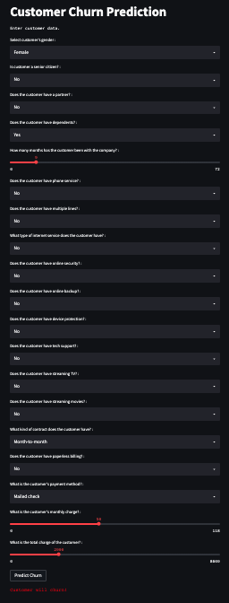

# Practical Data Science at Data Science Retreat 
In this class, we will use [streamlit](https://docs.streamlit.io/) to make a front-end application for interaction with a deployed machine learning model. We will also learn how to deploy it using streamlit cloud.

The application we will make will be to predict customer churn at a telecommunications company, using this [Telco customer churn data](https://www.kaggle.com/code/mechatronixs/telco-churn-prediction-feature-engineering-eda/data) from kaggle.

In the end, we will have an application that looks like this: 
.

As well as a live, functioning app, like the one seen [here](https://rachelkberryman-churn-predictor-prediction-streamlit-app-coqysw.streamlitapp.com/).
